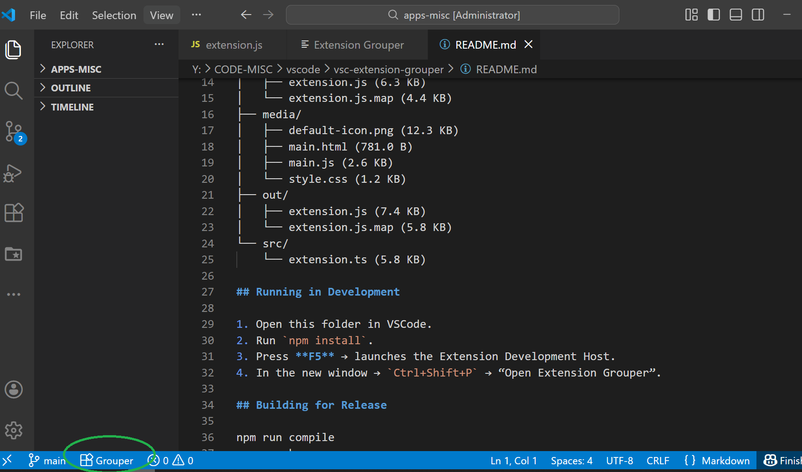
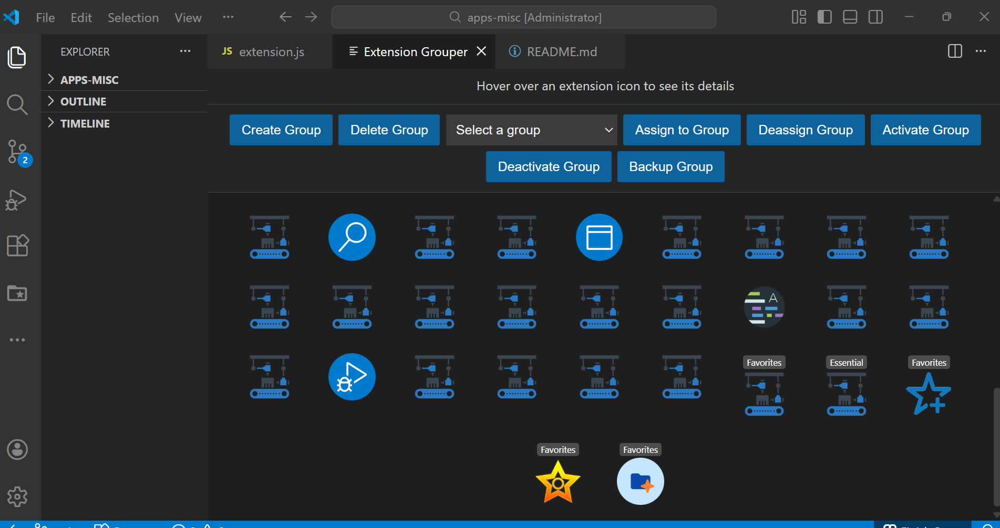
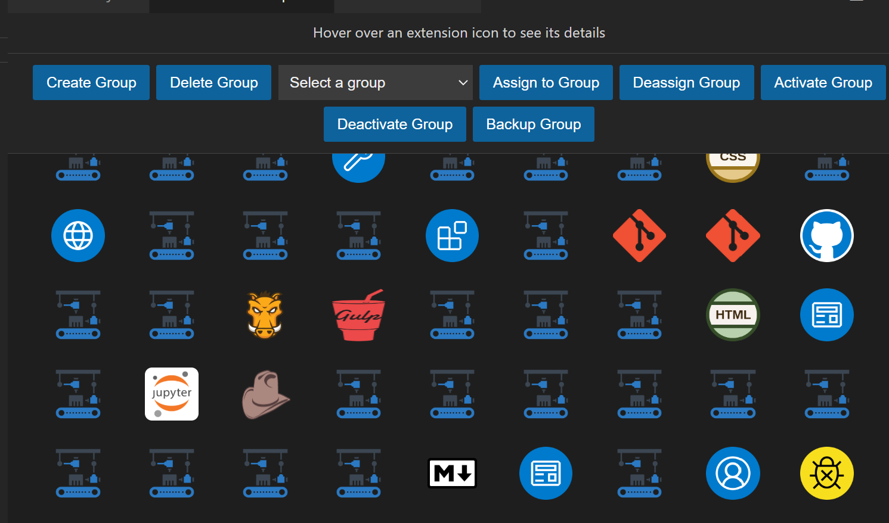

# VSCode Extension Grouper

A visual tool to **group, activate, deactivate, and manage multiple VSCode extensions at once**.  
Perfect for developers who switch between different workflows, tech stacks, or environments.

---

## ✨ Features

- 📦 Create named groups of extensions  
- 🗂 Assign and remove extensions from groups  
- ▶️ Activate a whole group with one click  
- ⏹ Deactivate a group just as easily  
- 🔄 Toggle individual extensions  
- 💾 Automatic persistence (stored in globalStorage)  
- 🖼 Extension icons display correctly  
- 🎨 Clean 3-panel UI (Extensions → Groups → Actions)

---
## Known Issue & Workaround

Microsoft has disabled API calls for enabling/disabling extension, Activation is impossible by clicking extension icon directly. Workaround: display code to manually install/enable. Unfortunately, I learnt about this way later during development (The idea works for browser extensions. I will release the ExtensionGrouper for Chrome in some time)

There are better extensions: 

"toolshive.vscode-quick-extension-manager"

"hayden.extension-pack-manager" 

"bloodycrown.simple-extension-manager"

So much for working a visually effective extension that does everything but what is required. 🤦🏽‍♂😅

## 📸 Screenshots

### Main UI


### Group Management


### Actions & Toggling


---

## 📁 Folder Structure

```ini
vsc-extension-grouper
├── LICENSE
├── README.md
├── extensionGroups.json
├── package-lock.json
├── package.json
├── tsconfig.json
├── dist/
│ ├── extension.js
│ └── extension.js.map
├── media/
│ ├── default-icon.png
│ ├── main.html
│ ├── main.js
│ └── style.css
├── out/
│ ├── extension.js
│ └── extension.js.map
└── src/
└── extension.ts
```
---

## 🧪 Running in Development

1. Clone or open this folder in VS Code  
2. Run:

   ```sh
   npm install
3. Press F5 to launch the Extension Development Host
4. In the new window:
   Ctrl + Shift + P → “Open Extension Grouper”

📦 Building for Release   

```bash
npm run compile
vsce package
```
This generates a .vsix file in the project root.

To install the packaged extension manually:
```bash
code --install-extension <name>.vsix
```

📝 .gitignore
```
node_modules/
out/
*.vsix
```

📜 License

MIT License — free for personal and commercial use.

❤️ Contributing

Pull requests are welcome!
If you find a bug or want a feature, open an issue.

⭐ If you like this extension…

Consider starring the repo on GitHub — it helps others discover it.